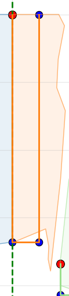

# NN_gals
Mentor branch
For run code use command 
python3 run_path_creator.py example_lables/f1_2503_jpg.rf.1d8f3aed4799fde82f50f2331f197da4.txt

run_path_creator.py - main script

example_lables/f1_2503_jpg.rf.1d8f3aed4799fde82f50f2331f197da4.txt - path to file

Problem
Do not fix problem with

HELP
For work with venv use command 
source .venv/bin/activate
or
deactivate 
